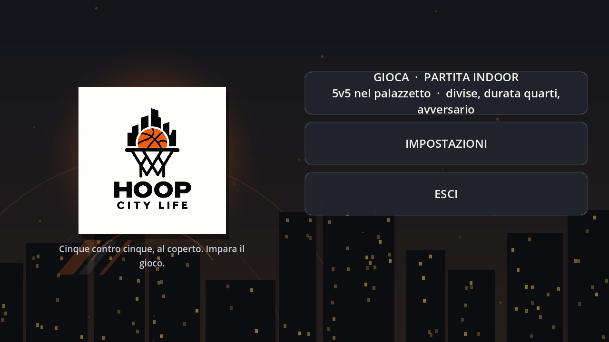
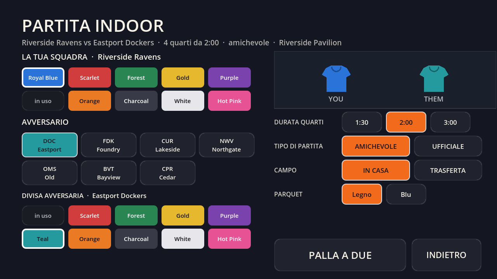
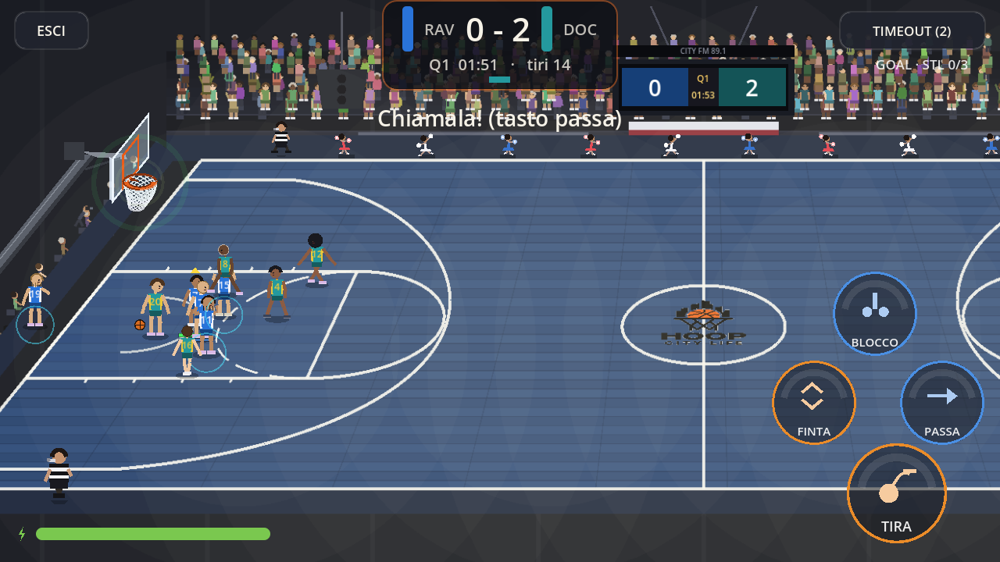

# Baskin Game — build indoor (step 1)

Deriva da **HoopCity / Hoop City Life** (Godot 4.3, `com.example.hoopcity`), ripulito
per diventare la base di un'app per **insegnare e giocare a baskin**.
Questo step lascia intenzionalmente solo lo scheletro: **schermata iniziale + partita indoor
con tutte le impostazioni di gioco**. Le regole del baskin si innestano qui sopra nei
passi successivi.

## Cosa c'è adesso

| Schermata | File | Cosa fa |
|---|---|---|
| Menu principale | `src/scenes/MainMenu.tscn` | schermata iniziale: **GIOCA · PARTITA INDOOR**, IMPOSTAZIONI, ESCI (logo + skyline animata) |
| Prepartita | `src/scenes/KitPicker.tscn` | tutte le impostazioni della partita in una schermata |
| Partita 5v5 indoor | `src/match/MatchScene.tscn` | motore completo: possesso, 24", falli, tiri liberi, rimbalzi, panchina/rotazioni, timeout, telecronaca, jumbotron, post-partita |
| Impostazioni | `src/scenes/SettingsScene.tscn` | schermo, comandi, audio, lingua (IT default), cancella salvataggio |

### Impostazioni di gioco (schermata prepartita)
- **Avversario**: uno degli 8 club del campionato (sigla + città).
- **Divise**: maglia tua e maglia avversaria, con blocco dei colori identici.
- **Durata quarti**: 1:30 / 2:00 / 3:00.
- **Tipo di partita**: *amichevole* (senza panchina né rotazioni) oppure *ufficiale* (panchina, sostituzioni del coach, stand pieni).
- **Campo**: in casa o in trasferta (nome dell'impianto secondo il club).
- **Parquet**: legno (maple) o blu — nuovo, si vede subito che il campo è indoor.

## Cosa è stato rimosso
Città e open world, creazione carriera/personaggio, palestra, campi outdoor/street, drill,
negozi, telefono, contatti/messaggi, social, libri, animali, eventi di carriera,
schedario e relativa UI. Restano i moduli minimi che il motore partita usa davvero
(`GameData`, `Season`, `Career`, `Sfx`, `SaveSystem`, `Events`, `Loc`, `Settings`, `UIKit`,
`SceneRouter`, `MatchGoals`, `Items`, `Contacts`).

## Come è stata provata
Ogni schermata è istanziata headless (`tools/LoadTest.tscn`) e la partita 5v5 è giocata da
un'IA (`tools/MatchTest.tscn`) su un campo reale: palla a due, 24", canestri, falli, panchina.
In più il ciclo completo *menu → prepartita → partita* è stato eseguito in un browser vero
(`tools/probe_ui_playthrough.py`, Playwright/Chromium): le immagini in `docs/screens/`
vengono da lì.

| Menu | Prepartita | Partita indoor |
|---|---|---|
|  |  |  |

## Come si apre / si esporta

```bash
# aprire il progetto in Godot 4.3 (o --import per rigenerare la cache)
godot --path . --import

# build web (variante senza thread: gira anche dentro un iframe sandbox)
godot --headless --path . --export-release "Web" export/web/index.html
python3 export/web/serve_web.py 8080      # server locale con MIME/CORS corretti

# APK Android (preset già configurato, firma debug del progetto)
# output: export/android/BaskinAcademy.apk  (versione in export_presets.cfg)
godot --headless --path . --export-release "Android"
```

### Test headless (dev, esclusi dall'export)
```bash
godot --headless --path . res://tools/LoadTest.tscn    # menu, prepartita, impostazioni
godot --headless --path . res://tools/MatchTest.tscn 30  # partita 5v5 completa
godot --headless --path . res://tools/SimRunner.tscn 3 --full   # simulazione AI vs AI
godot --headless --path . res://tools/SceneSmoke.tscn 8
```

## Note tecniche di questo step
- **Audio**: i bus (`SFX`, `Music`, `Crowd`, `Voice`) vengono creati su richiesta e ogni
  chiamata di volume/mute passa da un accessor sicuro. Prima, `Settings` applicava i volumi
  prima che `Sfx._ready()` creasse i bus: l'errore `Index p_bus = -1` e i livelli salvati
  che non venivano mai applicati all'avvio.
- **Scena principale** = `MainMenu` (l'intro animata era una seconda schermata iniziale:
  rimossa su richiesta).
- **Tocco/telefono**: `pointing/emulate_touch_from_mouse=true`, landscape, 1280x720.

## Roadmap baskin (prossimi passi)
1. **Regole**: punti per valore del giocatore (1–5 punti per canestro a seconda del ruolo),
   6 giocatori per squadra con almeno una ragazza e un atleta con disabilità in campo,
   ruoli 1–5 con vincoli (es. il ruolo 5 non può tirare da fuori, il ruolo 4 non può
   palleggiare in attacco…), area dei 3 punti vietata a chi ha valore 5 in attacco.
2. **Squadre**: rose con classificazione dei giocatori e controllo dei vincoli di campo.
3. **Formazione/insegnamento**: tutorial e spiegazioni delle regole in partita.
4. **Adattamento UI**: punteggio per ruolo, indicatori dei vincoli, avvisi di infrazione.
